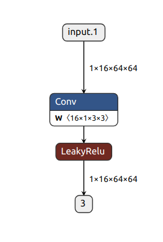
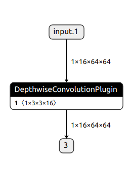

# TensorRT Custom Layer
TensorRTのエンジンに自作のpluginを組み込んで自作したカーネルが推論で使用されるように変更してみました  
今回はdepthwiseConvolutionを対象としました  
Custom Layerを実装する際に参考にしてみてください

## 使用したネットワーク


## pluginのbuild方法
depthwiseConvolutionPlugin/CMakeLists.txtの46行目を使用したデバイスに適した値に変更してください  
`$<$<COMPILE_LANGUAGE:CUDA>:-O3 -gencode arch=compute_xx,code=sm_xx>`

```bash
cd depthwiseConvolutionPlugin
mkdir build
cd build
cmake ..
make
```
depthwiseConvolutionPlugin/buildにlibdepthwiseConvolutionPlugin.soが作成されます

## onnx graphの作成
```bash
python make_onnx.py
```

## onnx graphの変更
```bash
python change_onnx.py
```
onnxグラフのノードの名前をpluginの名前に変更することで自作のpluginが使われるようになる  


## tensorRT engineのbuild
```bash
bash build_trt.sh
```

## tensorRT engineの実行
```bash
bash run_trt.sh
```
## test
```bash
python test.py
```
pluginを使ったenginと使用していないenginの結果を比較

## result
|  | 使用カーネル | average time[us]  | tortal time[us]  |
| --- | --- | --- | --- |
| **TensorRT with my plugin**  | dw_conv_fp16  | 3.77  | 3.77  |
| **TensorRT** | sm50_xmma_convolution_depthwiseHMMA_FP16NHWCx8_TR3_TS3_STRIDEH1_STRIDEW1 + generatedNativePointwise | 3.50 + 2.66  | 6.16  |  

leakyreluの部分は何故かgeneratedNativePointwiseという名前のカーネルが呼ばれている..  
depthwiseHMMAはどのようにHMMAを使っているのだろうか...


## 実行環境
- **GPU**: NVIDIA GeForce RTX 2080 SUPER
    - **SM数** 48
    - **CUDAコア数** 3072
- **GPUドライバ**: NVIDIA 535.104.05
- **CUDA**: 11.8
- **TensorRT**: 8.6.1
- **cuDNN**: 8.9.4
- **Python**: 3.10.12

## 参考リンク

- [公式ドキュメント](https://docs.nvidia.com/deeplearning/tensorrt/developer-guide/index.html#extending)
- https://github.com/NVIDIA/TensorRT/tree/main/tools/onnx-graphsurgeon/examples/08_replacing_a_subgraph
- https://github.com/NVIDIA/TensorRT/tree/69230e11dce7ba074539e477351e8344c4c3f27e/samples/python/onnx_custom_plugin